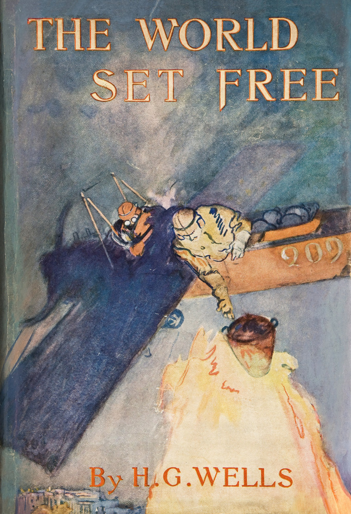

# La Liberazione del Mondo
## *The World Set Free* di H.G. Wells

  

Traduzione italiana del romanzo profetico di H.G. Wells (1914) che previde l'energia atomica e le sue conseguenze sulla civiltà umana.

---

## 📚 Indice dei Capitoli Disponibili

### ✅ Completati

- **[PRELUDIO: I Cacciatori del Sole](prelude_completo_IT.md)** *(8 sezioni)*
  - La storia dell'umanità dalla preistoria alla scoperta dell'energia
  
- **[Capitolo 1: La Nuova Fonte di Energia](capitolo_01_completo_IT.md)** *(8 sezioni)*
  - File completo disponibile

- **[Capitolo 2: L'Ultima Guerra](capitolo_02_completo_IT.md)** *(10 sezioni)*
  - File completo disponibile

### ⏳ In Lavorazione

- Capitolo 3: La Fine della Guerra
- Capitolo 4: La Nuova Fase
- Capitolo 5: Gli Ultimi Giorni di Marcus Karenin

---

## 🛠️ Workflow di Traduzione

Il progetto utilizza script Python per ottimizzare il processo:

1. **`split_chapter.py`** - Divide i capitoli in sezioni
2. **`translate_section.py`** - Guida la traduzione sezione per sezione
3. **`clean_translations.py`** - Rimuove elementi paratestuali
4. **`merge_sections.py`** - Riassembla le sezioni in file completi

### Glossario Termini Chiave

- **Carolinium** - L'elemento radioattivo fittizio scoperto da Holsten
- **Energia atomica** - Traduzione di "atomic energy"
- **Stato Moderno** - Traduzione di "Modern State"

---

## 📊 Statistiche

- **Capitoli tradotti**: 3/5 + PRELUDE (50%)
- **Sezioni totali**: 26 (8 PRELUDE + 8 cap.1 + 10 cap.2)
- **Caratteri tradotti**: ~184.000

---

## 📖 Note sulla Traduzione

Questa traduzione mantiene:
- Stile letterario elevato ma accessibile
- Terminologia scientifica dell'epoca
- Tono profetico e visionario dell'originale

---

## 📜 Licenza

Testo originale di pubblico dominio. Traduzione italiana © 2025.

---

*Progetto di traduzione in corso - Ultimo aggiornamento: 24 ottobre 2025*
